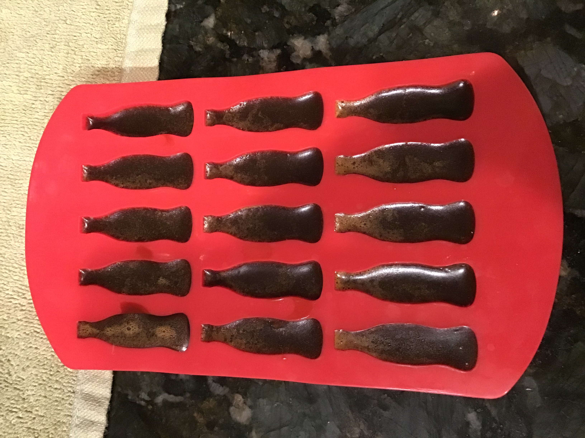

# Coca Cola Gummies

## Ingredients
- 14 oz. coca cola syrup - [we used this syrup](https://www.monin.com/us/sugarcane-cola-syrup-1.html)
- 1/4 cup medicated coconut oil
- 4 packets Knox gelatin
- 1/4 cup water

## Instructions
1. Add water to gelatin. Mix and allow to sit for 5 minutes.
2. Combine the syrup and coconut oil in a pot and heat. Do not allow the temperature of the syrup to pass 200 degrees Farenheit. 
3. Add the gelatin to the syrup mixtures and stir until gelatin is completely dissolved.
4. Allow to cool. Transfer to cup to pour into moulds.
5. Allow moulds to sit at room temperature until the candy has set. Store in the refrigerator. 

## Notes
- This recipe is loosely based on the recipe [found here](https://www.thespruceeats.com/cola-gummies-520894), which suggests adding citric acid to mimic the bite of carbonation
- The moulds we use for these are small ( < 6ml ), and so each individual gummy is not too potent. Beware if using larger moulds or if consuming many. 
