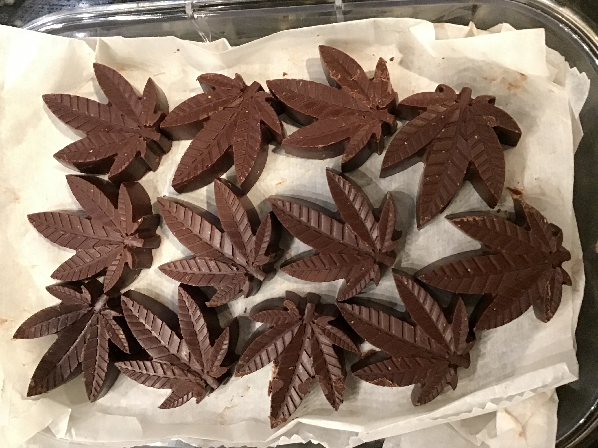

# Mint Meltaways

## Ingredients
- 520 g chocolate (70% cocao bittersweet - **not milk chocolate!**)
- 155 g mediated coconut oil
- 20 drops peppermint oil

## Instructions
1. Melt chocolate. We melted the chocolate in the microwave at half power in minute long intervals. Stir between each round in the microwave, and do not allow to burn. Desired final temperature ~ 108 degrees Farenheit.
2. Melt coconut oil. The oil should be liquid and does not need to be excessively hot - the chocolate and the oil will need to be the same temperature before mixing.
3. Allow chocolate and coconut oil to cool until both are within 2-3 degrees of 95 degrees Farenheit.
4. Combine chocolate, coconut oil, and peppermint oil. Stir to mix thoroughly. 
5. Allow mixture to cool to ~78 degrees Farenheit. Tranfer to piping bag and pour into moulds.
6. Allow to settle at room temperature. Store in covered container at room temperature.

## Notes
- We use 6ml moulds for these and they are just the right size! 
- Alternatively, we found that paper wrappers like those on Reese's peanut butter cups work pretty well too!