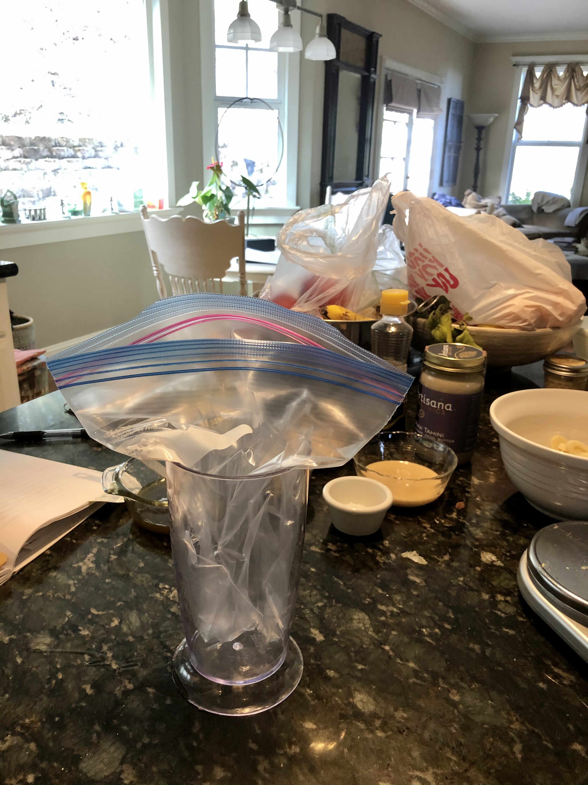
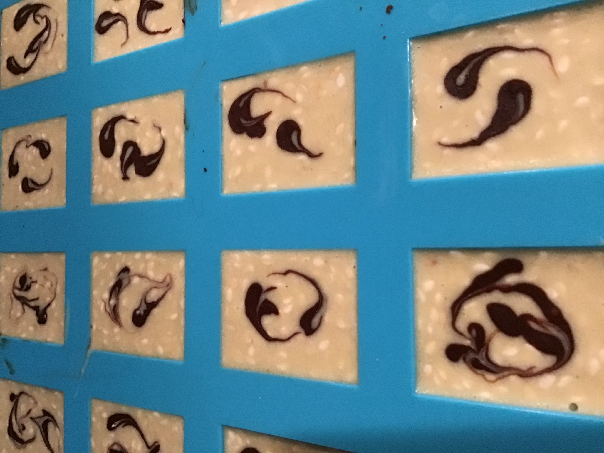

# Tahini Meltaways

## Ingredients
### Dark chocolate layer
- 540 g chocolate (70% cocao bittersweet)
- 135 g medicated coconut oil
- 65 g tahini
- 1/4 tsp fleur de sel, pulverized
- 1/2 tsp toasted sesame oil

### White chocolate layer
- 220 g white chocolate ( valrhona 35% )
- 1/2 tsp toasted sesame oil
- 65 g medicated coconuk oil
- 65 g tahini
- 1/4 tsp fleur del sel, pulverzied 
- 60 g toasted sesame seeds

## Instructions
1. Melt dark chocolate in microwave. 
    - Use microwave at **half power**. Start with 4 minutes and then stir. 
    - Add additional time until chocolate is entirely melted and temperature is ~113 degree Fahrenheit
    - **Do not allow chocolate to get hotter than 120 degrees Fahrenheit.**

2. Melt oil for dark chocolate layer (135 g). 
    - Use microwave at full power for 45 seconds and stir. 
    - Add additional 15 second intervals until oil is completely melted. 
    - Allow to cool to below 130 degrees Fahrenheit
    - If the oil gets too hot, put it in the fridge for a bit

3. Combine dark chocolate layer ingredients and mix thoroughly. Allow to cool to ~80 degrees Fahrenheit. 
    - We transfered to the piping bag (a gallon ziplock) and rolled the bag on the granite counter to cool.

4. Pipe dark chocolate into first 2/3 of molds.
    - We used 14ml and 6 ml square molds - these remain fairly soft, so detailed molds might not work as well
    - Allow to set away from heat and direct sunlight
    - It helps to hold up the bag in a cup or pitcher to fill.
    

5. Melt white chocolate in microwave. 
    - Use microwave at **half power**
    - Start with 2 minutes and then stir. 
    - Add addition time until chocolate is entirely melted and temperature is ~90-95 degrees Fahrenheit. 
    - **Do not allow white chocolate to get hotter than 110 degrees Fahrenheit**

6. Melt the oil for the white layer (65 g). Allow to cool to below 130 degrees Fahrenheit.

7. Combine all ingredients for the white layer **except for the sesame seeds** and mix thoroughly.

8. Allow white choloate mixture to cool.

9. Once the dark chocolate layer has set (it will transistion from a glossy to matte surface texture), check the temperature of the white chocolate mixture. Ideally it should be ~75 degrees Fahrenheit.

10. Add toasted sesame seeds to white chocolate mixture and stir in thoroughly.

11. Pipe white chocolate into remaining 1/3 of mold. 
    - If you want to add decorative touches, try not to overfill your molds

12. **Optional** For a decorative touch, use any remaining dark chocolate to add small dot (or multiple dots) to the white chocolate layer. Use a toothpick or something similar to spread the dark chocolate over the white chocolate into interesting patterns! 

